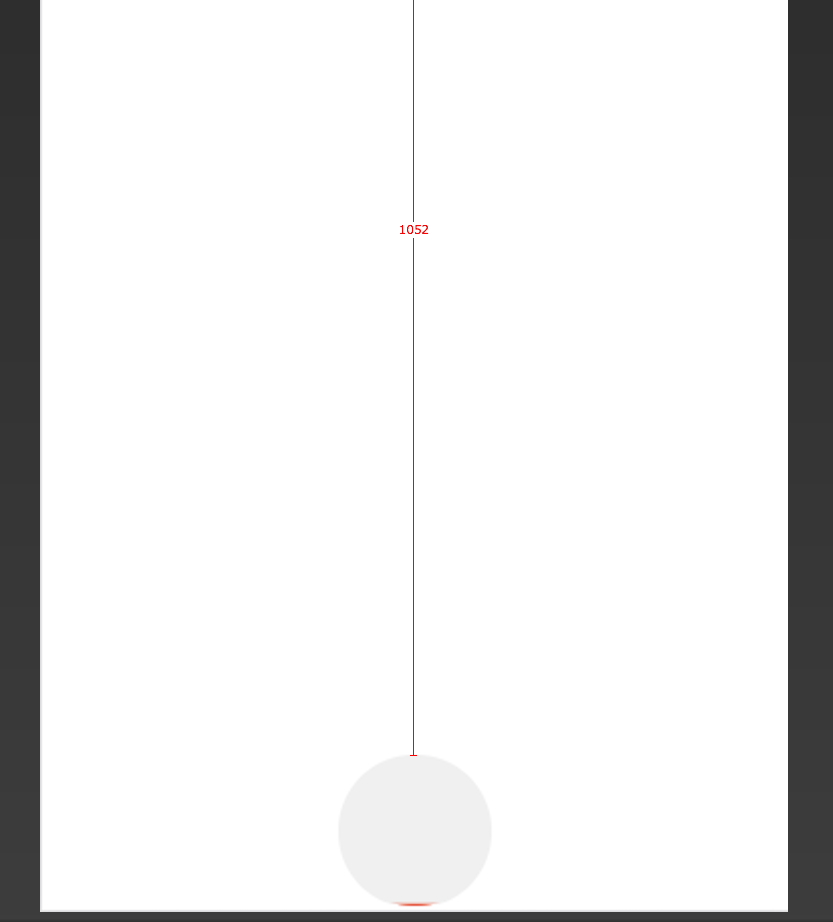
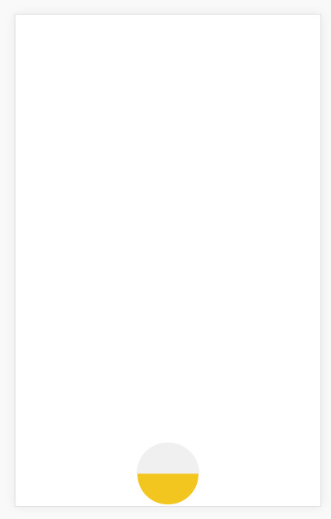
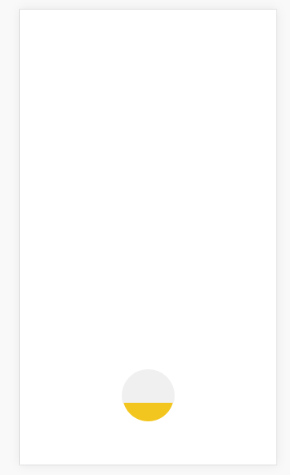
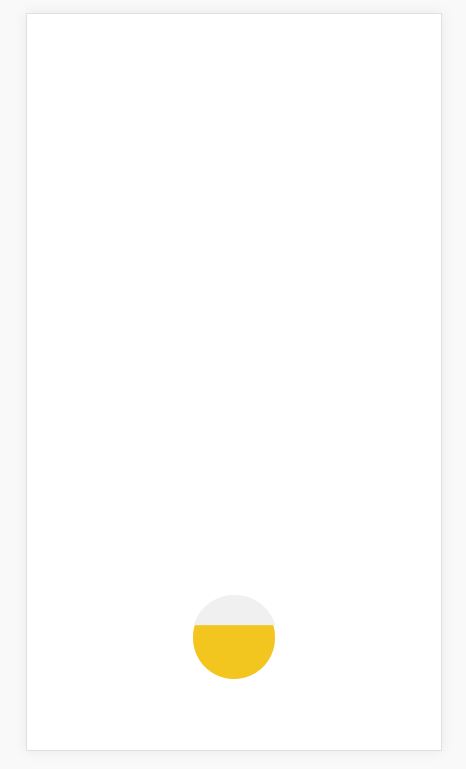
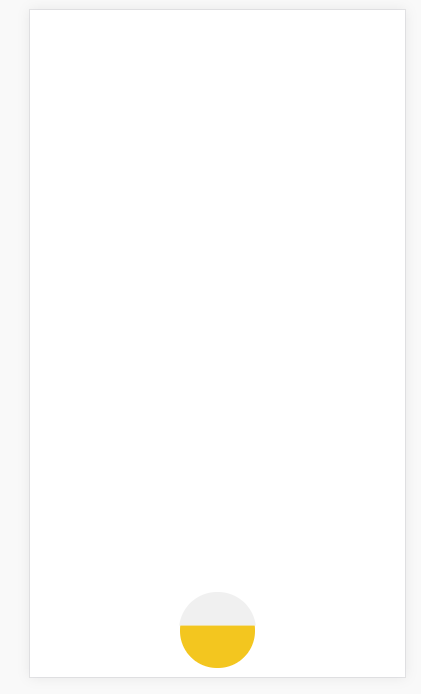
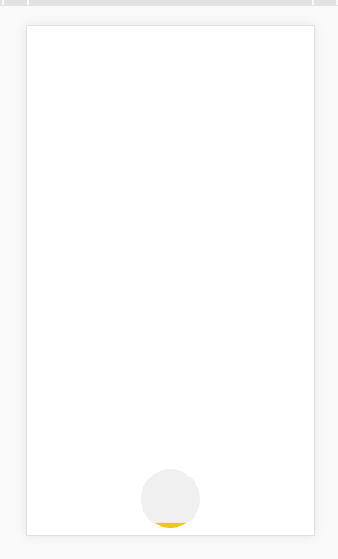
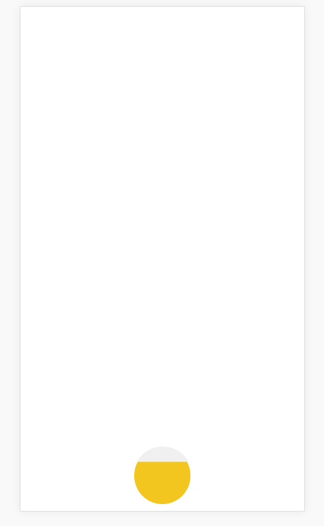

### 满屏单页面适配问题的解决方案

起因：在做一些H5营销案例的时候，因为大多数的H5都是单页面满屏的。曾经采取的方案也比较简单，无论元素的大小，还是字体以及元素的位置布局，都是使用一套rem单位。

所有元素都使用一套rem单位的优点在于所有元素都可以对照着设计稿，在不同的设备下都等比的缩放。

但是，因为各设备屏幕的宽高比都是不一样的，而此时如果我们布局中存在某些元素是贴在页面的底部边缘的话，去到某些设备下可能会导致这些元素被挤下去了，挤到了屏幕的边缘外。需要拖拽滚动条才能正常的看到底部元素。

这对于我们的这种满屏的H5案例肯定是不能接受的。

#### 解决方案

目前想到的解决方案比较简单，配合rem单位以及vh单位。

在元素的大小布局上，我们可以使用rem来进行设值。而具体到某个元素的高度定位，则转换为使用vh单位布局。这样就可以保证在不同的设备下，既能让元素正常的缩放，同时又可以保证页面可以正常的显示所有的内容。

#### 实践

rem以及vh单位的换算可以通过scss转换，不需要手动换值。

字体方面找到一篇玉伯的文章，里面提到字体不要使用rem单位，因为会转换到一些奇怪的px最终导致字体效果奇怪。他推荐字体直接使用px单位。

另外就是vh单位可能会存在兼容性的问题，具体还有待测试。

如果我们需要实现以下的设计稿效果

可以看到，我们的高度在设计稿中量的是1052，基本贴到了底部下面。

在我们基于rem单位实现了元素的大小设置后，在高度方面如果我们的代码中这样写

    top: tr(1052);

    /**
    * px单位转换到rem单位 设计稿750 iPhone6下的二倍稿
    * 使用方法 tr(750) 会被自动转换为 3.75rem
    */
    @function tr($px){
        @return $px/200*1rem;
    }

也就是说如果我们使用rem来实现高度的布局，那么看到的效果将会是这样的

在iPhone6下可以说是正常的，与设计稿基本一致。但是去到其他宽高比不同的手机下，例如ip5以及ip6p则是以下这样的

原因就是前面提到的，rem会随着屏幕的宽度而改变，用来做高度的布局不是很好。

那么我们改为用vh实现布局，如下

    top: vh(1052);

    /**
    * px单位转换到vh单位 设计稿750 iPhone6下的二倍稿
    * 使用方法 vh(1206) 会被自动转换为 100vh
    */
    @function vh($px){
        @return $px/12.06*1vh;
    }

依次是6 5 6p下的效果

可以发现元素的高度在不同的设备下都保持了一致。

所以针对这些满屏的单页面项目，如果不考虑vh单位的兼容性为题，在做适配的时候，我们可以考虑使用rem单位来对元素的`width`以及`height`进行设定。

而对于`top`或者`margin-top`这些单位则转换为vh单位实现布局。这样就可以保证所有的内容都可以根据设计稿正常的等比缩放，另一方面又能让各元素的高度也正常的布局。

具体的实践可以看代码，使用起来十分简单。

